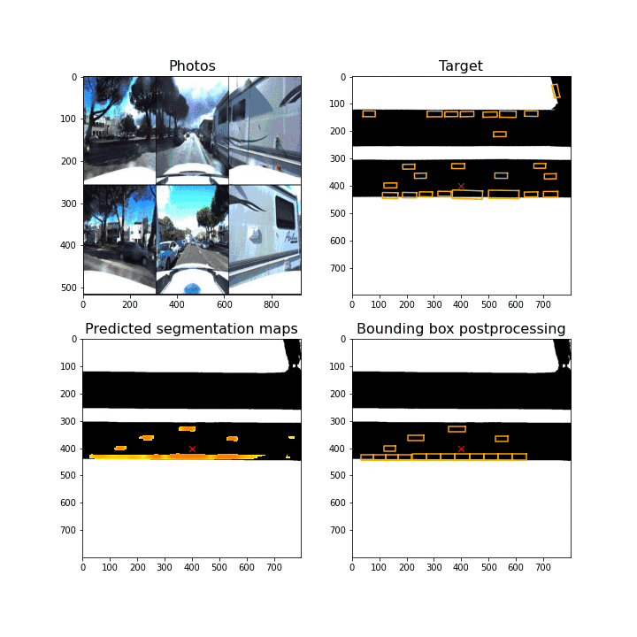

# Bird's Eye View layout prediction: roads and cars
#### Final project for Deep Learning course (DS-GA 1008, NYU Center for Data Science)  
#### Top-1 in both tasks: road layout prediction and car bounding boxes prediction
#### Shreyas Chandrakaladharan, Marina Zavalina, Philip Ekfeldt

#### [Report](report/DL_project_report.pdf) | [Video](https://www.youtube.com/watch?v=h6EQ-l9OZIc&t=1s)

## Abstract
In this project we focus on Bird's Eye View (BEV) prediction based on monocular photos taken by the cameras on top of the car. We present a Maximum Mean Discrepancy Variational Auto Encoder (MMD VAE) model to predict the BEV road layout. We also contribute an approach combining Image Warping, U-Net and Post-processing to predict the bounding boxes (BB) on the BEV layout. Our models achieve **0.81 test threat score on the road layout prediction task and 0.072 test threat score on the BB prediction task**. Animations below visualize the predictions of our final models.

## Animations
### Predictions of the final models

### Projecting photos to Bird's Eye View

---
## Usage
### Generate and save labels
Use `generate_labels.py` to generate
- vehicles mask
- road mask
- warped and glued photos

### Road Layout Prediction
Refer to road_layout_prediction/ for code used to train and test road layout prediction models.  

**Contents**: 
- road_layout_prediction.ipynb - Main notebook, Training & Evaluation 
- modelszoo.py - Model Architectures and Loss functions 

### Bounding Boxes Prediction
**Libraries used** 
- [Pytorch Lightning](https://github.com/PyTorchLightning/pytorch-lightning)
- [FastAI](https://github.com/fastai/fastai)
- [Kornia](https://kornia.github.io/)
- [OpenCV](https://opencv.org/)

**Code** 
- Folder vehicle_layout_predictions
  - model_zoo.py - Model architectures used
  - pl_modules.py - Pytorch lightning modules
  - train.py - Example training code
- Notebook fastai_final_for_cars.ipynb

### Self-supervised learning (tried but didn't use in final models)
- Shuffle and learn: [ssl_ideas/shuffle_and_learn](ssl_ideas/shuffle_and_learn)
- Contrastive learning, SimCLR: [ssl_ideas/simclr](ssl_ideas/simclr)

---
Parts of code sourced from:

- https://github.com/Chenyang-Lu/mono-semantic-occupancy 
- https://github.com/napsternxg/pytorch-practice/blob/master/Pytorch%20-%20MMD%20VAE.ipynb 
- https://github.com/mdiephuis/SimCLR/blob/master/loss.py  
- https://github.com/guptv93/saycam-metric-learning/blob/master/data_util/simclr_transforms.py  

### Papers and useful links:
- InfoVAE (https://arxiv.org/abs/1706.02262)  
- Understanding MMD: https://ermongroup.github.io/blog/a-tutorial-on-mmd-variational-autoencoders/  
- MonoOccupancy (https://arxiv.org/pdf/1804.02176.pdf)
- UNet (https://arxiv.org/abs/1505.04597)
- Monocular Plan View Networks for Autonomous Driving: https://arxiv.org/pdf/1905.06937.pdf
- Review of papers on 3D object detection : https://towardsdatascience.com/monocular-3d-object-detection-in-autonomous-driving-2476a3c7f57e
- Inverse perspective mapping (IPM): from monocular images to Birds-eye-view (BEV) images

