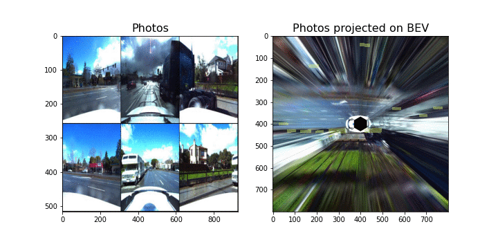

# Deep Learning Project

Final project on Bird's Eye Prediction for DL course

Papers and useful links:
- InfoVAE (https://arxiv.org/abs/1706.02262)  
- Understanding MMD: https://ermongroup.github.io/blog/a-tutorial-on-mmd-variational-autoencoders/  
- MonoOccupancy (https://arxiv.org/pdf/1804.02176.pdf)
- UNet (https://arxiv.org/abs/1505.04597)
- Monocular Plan View Networks for Autonomous Driving: https://arxiv.org/pdf/1905.06937.pdf
- Review of papers on 3D object detection : https://towardsdatascience.com/monocular-3d-object-detection-in-autonomous-driving-2476a3c7f57e
- Inverse perspective mapping (IPM): from monocular images to Birds-eye-view (BEV) images

## Projections

Transfer labels from top down view to camera photos using projection geometry. 
https://kornia.github.io/ 

## Road Layout Prediction

Refer to road_layout_prediction/ for code used to train and test road layout prediction models.

**Contents**: 
- road_layout_prediction.ipynb - Main notebook, Training & Evaluation 
- modelszoo.py - Model Architectures and Loss functions 
- simclr*, contrastive* - Code related to SimCLR implementaion for unsupervised training 

Parts of code sourced from:

- https://github.com/Chenyang-Lu/mono-semantic-occupancy 
- https://github.com/napsternxg/pytorch-practice/blob/master/Pytorch%20-%20MMD%20VAE.ipynb 
- https://github.com/mdiephuis/SimCLR/blob/master/loss.py  
- https://github.com/guptv93/saycam-metric-learning/blob/master/data_util/simclr_transforms.py  

## Bounding Box Predictions

**Libraries used** 
- [Pytorch Lightning](https://github.com/PyTorchLightning/pytorch-lightning)
- [FastAI](https://github.com/fastai/fastai)
- [Kornia](https://kornia.github.io/)
- [OpenCV](https://opencv.org/)

**Code** 
- Folder vehicle_layout_predictions
  - model_zoo.py - Model architectures used
  - pl_modules.py - Pytorch lightning modules
  - train.py - Example training code
- Notebook fastai_final_for_cars.ipynb
## Animations

### Predictions

### Projection

